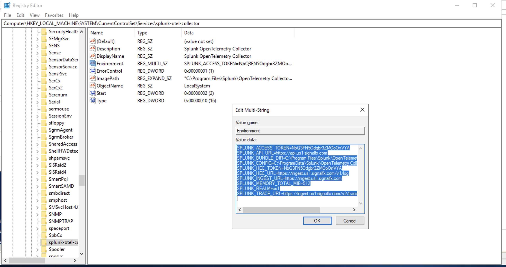

## Update the Open Telemetry Collector configuration to export application logs

The Collector configuration is a YAML file  which specifies the behavior of the different components and services. By default, it’s stored in C:\ProgramData\Splunk\OpenTelemetry Collector\agent_config.yaml.

The HEC export configuration is defined in the snippet below

```
splunk_hec:
token: "${SPLUNK_HEC_TOKEN}"
endpoint: "${SPLUNK_HEC_URL}"
source: "otel"
sourcetype: "otel"
index: "main"
profiling_data_enabled: false
```

Instead of updating environment variables directly in the configuration file (although you can if you want to), based on the specified installation parameters for MSI installer, the environment variables are sourced from the following registry key

Registry Key Path:
```
HKLM:\SYSTEM\CurrentControlSet\Services\splunk-otel-collector .
```

Registry Key Name:
```
Environment
```

Registry Key Values:

```properties
SPLUNK_HEC_URL=
SPLUNK_HEC_TOKEN=
```



Restart splunk-otel-collector service for changes to take effect.

```
Stop-Service splunk-otel-collector
Start-Service splunk-otel-collector
```
